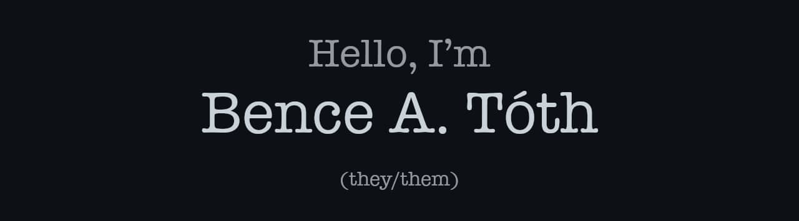

<!--
**bence-toth/bence-toth** is a ✨ _special_ ✨ repository
because its `README.md` (this file) appears on your GitHub profile.
-->

  

Engineering manager. Front-end developer at heart. Software architect, tech lead, educator, mentor, volunteer, open source advocate, functional programming enthusiast, a11y and i18n nerd, CSS ninja, wannabe viking.

I build software and relationships. I have a knack for people and getting things done.

I believe that whatever you do, empathy and compassion will go a long way. Be a decent human, and everything else will fall in place.

I might not be wrong about everything I say.

Currently working as an Engineering Manager at [Zendesk](https://github.com/zendesk), and volunteering at [HackYourFuture](https://github.com/HackYourFuture-CPH), [Impact Roasters](https://github.com/impact-roasters), [CodeForward](https://github.com/code-forward-dk), and more.

You can also [find me on LinkedIn](https://www.linkedin.com/in/bence-a-toth/) or send me an email at tothab@gmail.com.
